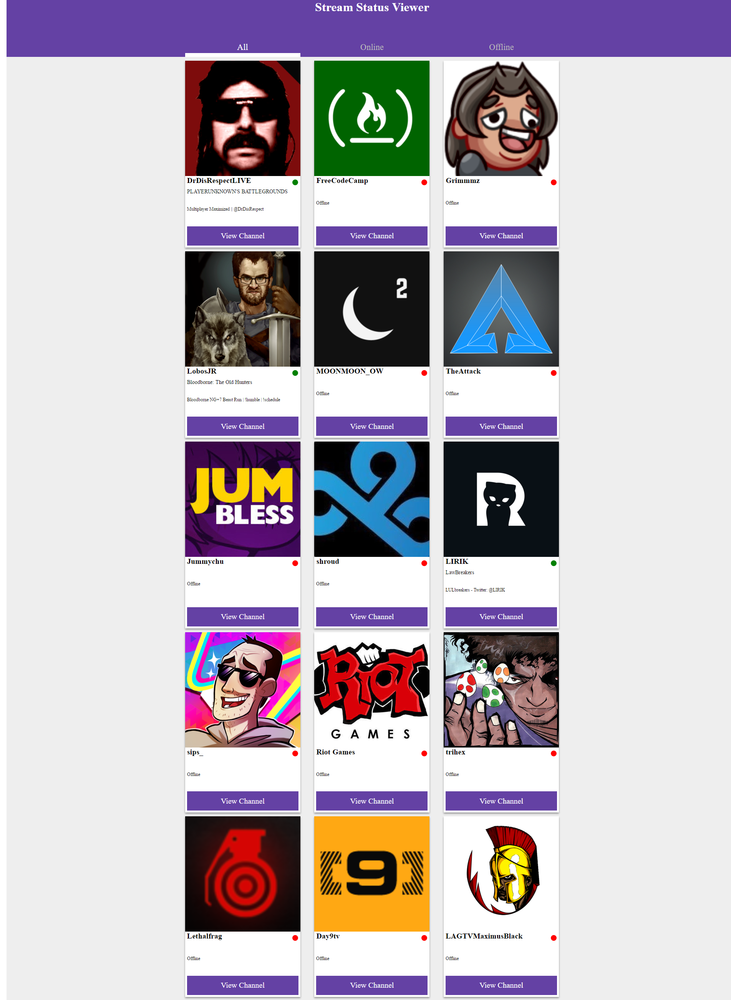

# Twitch Streamer Status

A Twitch streamer live-status site I have created while going through the intermediate front end development project challenges at https://freeCodeCamp.com

## [Local Weather](https://github.com/Squibs/freeCodeCamp/tree/master/Front%20End%20Development%20Certification#twitch-streamer-status) (Go Back)

### [Twitch Streamer Status](https://squibs.github.io/twitch-streamers/) (Click to view functional site)

<em>Completed June 24, 2017</em>

The final intermediate front end developent project I completed on freeCodeCamp. For this project I used the Twitch.tv api in order to pull informaiton about various streamers. I used CSS flexbox and grid for this project, to learn more about them.

I learned several things while working on this particular project. To start off, I found out the hard way about an issue in Safari based browsers where declaring a let or const variable, in JavaScript, that shares the same name as a selected html id attribute creates an error. These is something I'll have to keep in mind as I am working with JavaScript in the future. A work around is to declare the variable as a var rather than a let or const; or to rename the variable instead.

The second thing I learned was yet another issue pertaining to Safari browsers. Using css height properties with percentage based values can cause issues if the parent(s) of the selected element do not have a specified height. Sometimes giving specific values rather than general / prediction based heights can help reduce layout problems later. I was trying to make everything in this project flexible to screen-size, but in doing so I created several issues for myself. This is another thing I will have to keep in mind in the future and see if I can find a better way to accomplish what I wanted.

